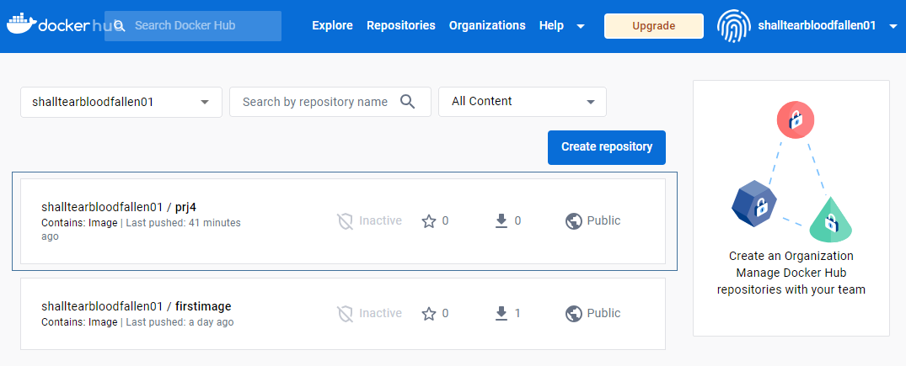
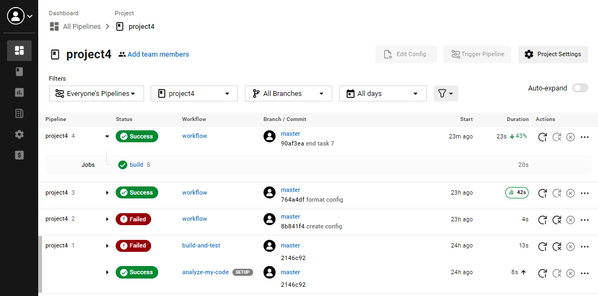

<include a CircleCI status badge>

## Project Overview

You are given a pre-trained, `sklearn` model that has been trained to predict housing prices in Boston according to several features, such as average rooms in a home and data about highway access, teacher-to-pupil ratios, and so on. You can read more about the data, which was initially taken from Kaggle, on [the data source site](https://www.kaggle.com/c/boston-housing). This project tests your ability to operationalize a Python flask app—in a provided file, `app.py`—that serves out predictions (inference) about housing prices through API calls. This project could be extended to any pre-trained machine learning model, such as those for image recognition and data labeling.

### Project Tasks

Your project goal is to operationalize this working, machine learning microservice using [kubernetes](https://kubernetes.io/), which is an open-source system for automating the management of containerized applications. In this project you will:
* Test your project code using linting
* Complete a Dockerfile to containerize this application
* Deploy your containerized application using Docker and make a prediction
* Improve the log statements in the source code for this application
* Configure Kubernetes and create a Kubernetes cluster
* Deploy a container using Kubernetes and make a prediction
* Upload a complete Github repo with CircleCI to indicate that your code has been tested

To create this project consisted of 8 tasks:
* Task 1: Complete the Dockerfile
* Task 2: Run a Container & Make a Prediction
* Task 3: Improve Logging & Save Output
* Task 4: Upload the Docker Image
* Task 5: Configure Kubernetes to Run Locally
* Task 6: Deploy with Kubernetes and Save Output Logs
* Task 7: Delete Cluster
* Task 8: CircleCI Integration

I pushed the image up, I registered an account at https://hub.docker.com/ and did docker login
My image is here:
shalltearbloodfallen01/prj4:v1.0.0

In addition to the commands in the repository, the commands I execute to run the test are:

make lint : to see if hadolint catches any errors in your

./run_docker.sh : do run_docker.sh build and run the docker image defined in the Dockerfile

./upload_docker.sh: upload images to dockerhub

./make_prediction.sh: sending some input data to your containerized application via the appropriate port

./run_kubernetes.sh: deploy with Kubernetes

minikube delete and minikube stop to delete cluster

I do a deployment to circle and it immediately succeeds:

